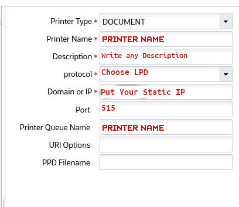

# lprng-Server
Setup Print Server via LPRng for Oracle WMS 
<br />

 


## Introduction
On Oracle WMS or Logfire prefered to make print server to sure print the labels. Unfortunately, On Oracle WMS or Logfire only use port "9100" and "515". In table below, it is showing the diffrent between them and on this script you will install [LPRng](https://lprng.sourceforge.net/).

| Port | Explanation                                                                                                                                         |
|------|-----------------------------------------------------------------------------------------------------------------------------------------------------|
| 9100 | The default configuration of some HP Printers and Zebra Sender enables the Remote Firmware Update (RFU) setting. Usually deals with Samba programs. |
| 515  | Printing services, listening for incoming connections. Usually, LPR/LPD (Line Printer Remote/Daemon) use this Port.                                 |

## Requirment

* Debian 12 Distro
* APT Package Manager (Up-to-Date).
* Internet
* Static IP from ISP. 

## Usage
To use script, just clone it and run /install.sh/ script.

``` bash
git clone https://github.com/Mohammed-Alnahdi/lprng-Server.git
cd lprng-Server
sudo bash install.sh
```

#### Note
The script will remove Cups and not run without root privilige.

### How add new printer
For adding new printer or change details for printer, you can modifying file /etc/printcap and add <your-printer-name> with <local-ip-for-printer>

``` bash
$<your-printer-name>|localprinter:\
:lp=<local-ip-for-printer>%9100:\
:sd=/var/spool/lpd/<your-printer-name>:\
:mx#0:\
:sh:" 
```

#### Note
Don't duplicate printer name or IP.

### WMS side Setup
go to adding printer page and set your printer there as below: 
<br />


